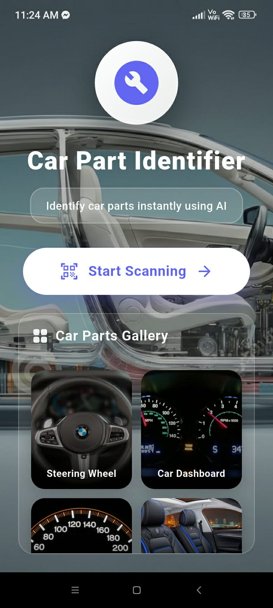
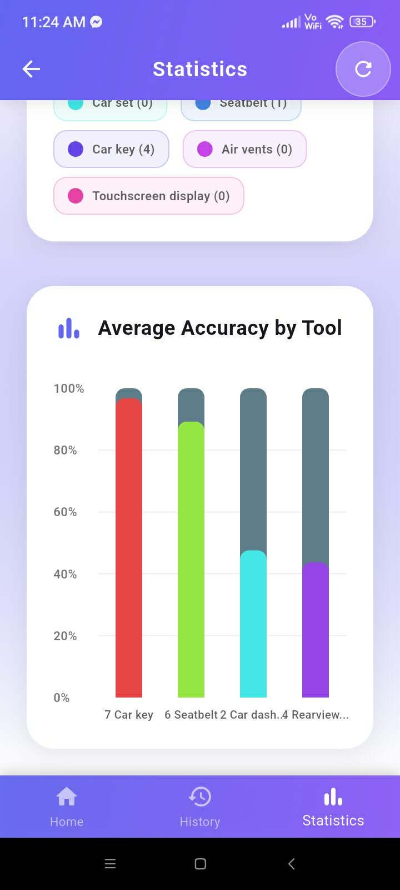
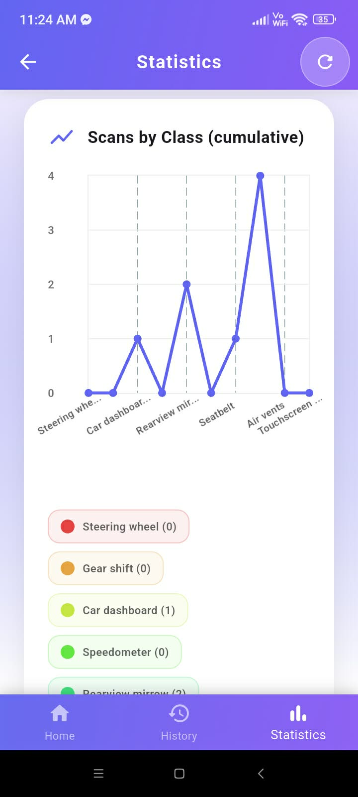
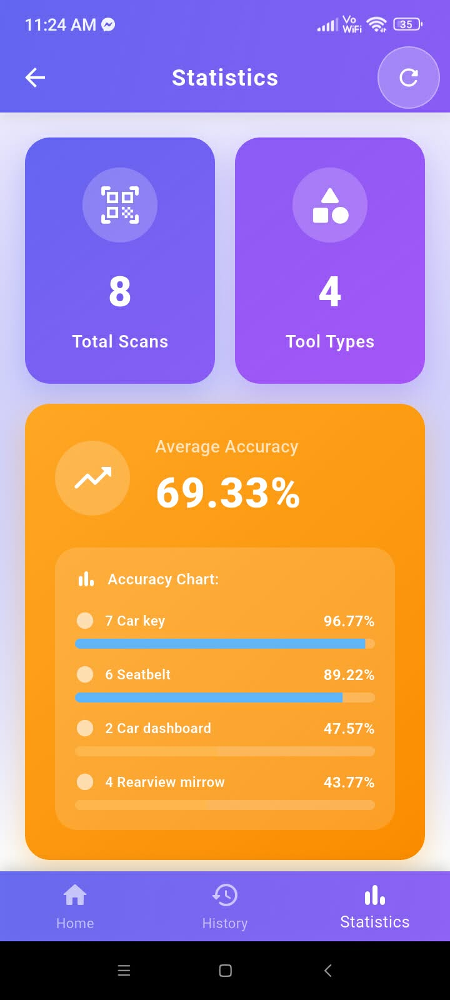
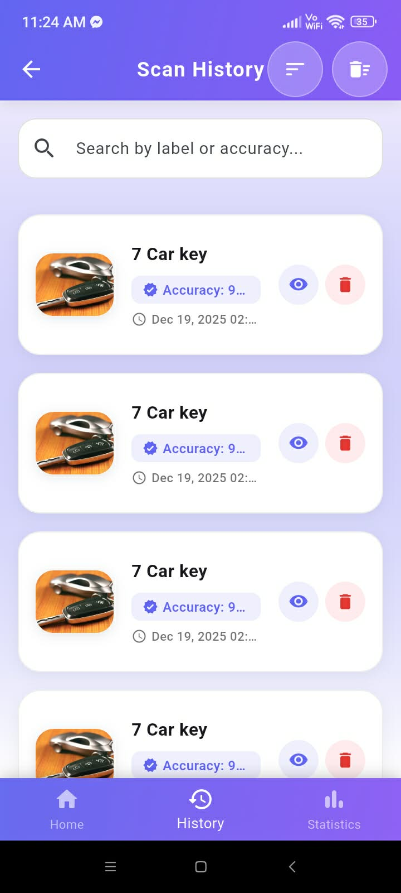
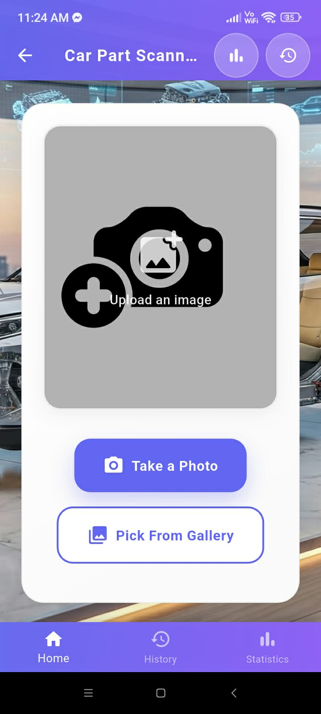
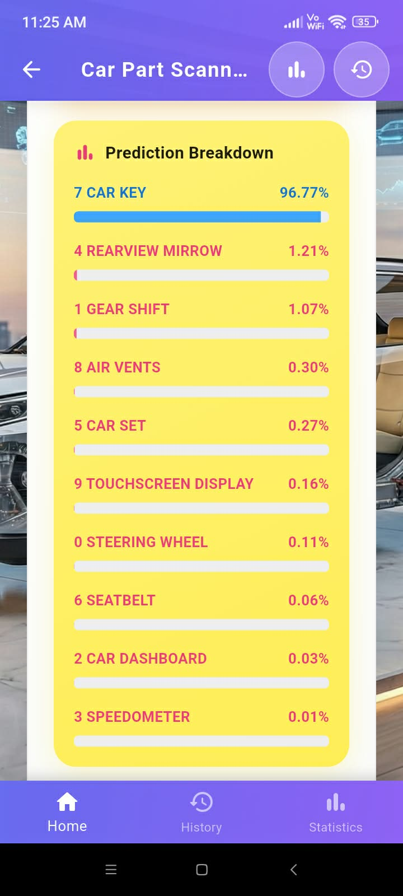

<h1 align="center">👋 WELCOME TO MY PROFILE</h1>

<h2 align="center"><strong>Leyo Consistente</strong></h2>

<em>IT Student</em>

---

## 🙋‍♂️ About Me

I am an IT student with hands-on experience in web application development, 
and I am currently expanding my skills into mobile app development using Flutter and Firebase.
I enjoy building real-world applications, focusing on functionality, usability, and clean UI design across both web and mobile platforms.
I am passionate about learning new technologies and continuously improving my skills in software development.

---

## 🎯 Current Focus

* Building functional mobile apps using **Flutter + Firebase**
* Strengthening backend logic and database management
* Exploring modern frontend and backend development practices

---

## 🧰 Core Skills & Technologies

### 💻 Languages & Frameworks

### 🗄️ Databases

### 🔧 Version Control & Tools

---

## 📚 Learning & Development

* Implementing authentication and CRUD features
* Understanding database structure and data flow
* Improving UI/UX design for mobile and web apps
* Writing maintainable and production-ready code

---

## 🎯 2025 Goals

- [ ] Build and publish a complete mobile app using **Flutter + Firebase**
- [ ] Contribute to at least one open-source project
- [ ] Learn a new backend or cloud technology to strengthen full‑stack skills
- [ ] Join or complete a multi-week coding challenge to improve consistency
- [ ] Create or refine a personal portfolio website to showcase projects

---

## ✨ Fun Fact

I enjoy designing clean, modern, and user-friendly interfaces that make apps enjoyable to use.

---

## 🛠️ Car Parts Classes Overview

Below is a quick overview of the car parts classes that **Car Parts Identifier** can recognize, with a short description and a sample image for each class.

| Class Name             | Description                                                                                          | Sample Image |
|------------------------|------------------------------------------------------------------------------------------------------|-------------|
| **Air Vent**           | Ventilation system component that allows air to flow into the car cabin. Used for climate control and air circulation. |  |
| **Car Dashboard**      | The main control panel located in front of the driver. Contains instruments, controls, and displays for vehicle operation. |  |
| **Car Key**            | Key used to start the vehicle and unlock doors. Modern versions may include remote control or keyless entry features. |  |
| **Car Seat**           | Seating component designed for passenger comfort and safety. Includes adjustable features and safety restraints. |  |
| **Gear Shift**         | Control mechanism for changing gears in manual or automatic transmissions. Allows driver to select driving mode. |  |
| **Rearview Mirror**    | Mirror mounted inside the vehicle that allows the driver to see behind the car. Essential for safe driving and parking. |  |
| **Seatbelt**           | Safety restraint system designed to protect occupants during collisions. Should be worn at all times while driving. |  |
| **Speedometer**        | Instrument that displays the vehicle's current speed. Located on the dashboard for easy monitoring while driving. |  |
| **Steering Wheel**     | Control device used to steer the vehicle. Allows driver to change direction and maintain control of the car. |  |
| **Touchscreen Display**| Interactive screen interface in modern vehicles. Used for navigation, entertainment, climate control, and vehicle settings. |  |

---

## 📸 App Screenshots

### 🏠 Main Screens

<table>
  <tr>
    <td></td>
    <td></td>
  </tr>
</table>

### 📊 Statistics & History

<table>
  <tr>
    <td></td>
    <td></td>
    <td></td>
  </tr>
  <tr>
    <td></td>
    <td></td>
    <td></td>
  </tr>
</table>

---

## 🚀 Key Features Summary

| Feature                  | Description                                                                                                                     |
|--------------------------|---------------------------------------------------------------------------------------------------------------------------------|
| **Tool Image Capture & Upload** | Users can either scan a new tool using the camera or pick an existing photo from their gallery to use as input for recognition. |
| **Automatic Tool Recognition**  | The app runs an image classification model to predict which tool class the image belongs to, based on the supported tool types.   |
| **Confidence Indicator**       | Each prediction includes a confidence value so users can see how certain the model is about the detected tool.                      |
| **Tool Details & Usage Tips**  | After a scan, users can view a short description of the tool, along with common uses and basic safety or handling tips.            |
| **Usage Statistics**           | A simple stats screen summarizes how often each tool type has been scanned, giving users an overview of their scan activity.      |
| **Scan History with Management** | Previous scans are stored with timestamps so users can review older results, and they can delete individual entries when needed.   |

---

## 📊 GitHub Stats

  

  
  

